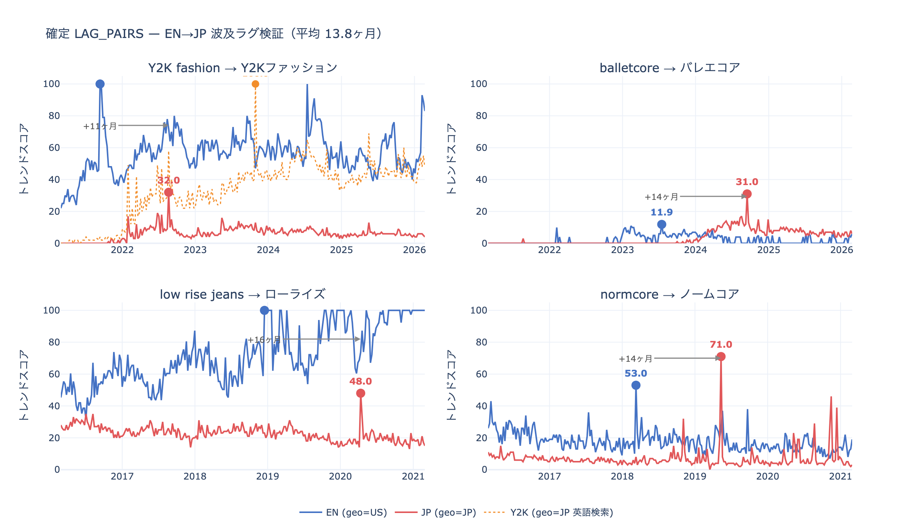
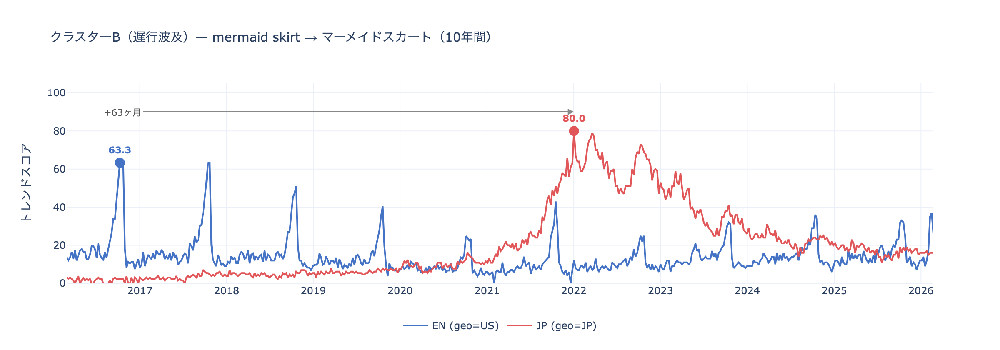
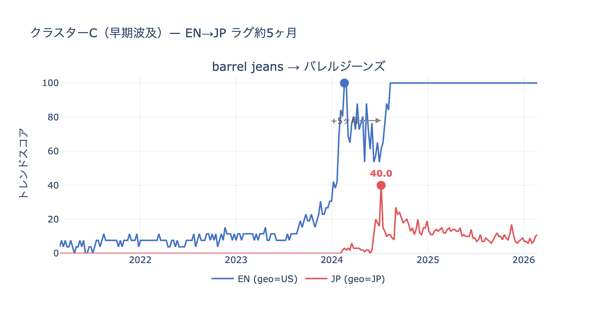

# LAG_PAIRS 選定分析ノート

ファッショントレンドの EN→JP 波及ラグを定量化するために使用するペア（LAG_PAIRS）の
選定過程をまとめたドキュメント。

---

## 1. 分析の目的

Google Trends データを用いて「英語圏でトレンドがピークを打った後、
何週間遅れて日本でも同じトレンドがピークを打つか」を計算し、
現在上昇中の英語トレンドキーワードから **日本波及タイミングを予測** する。

この「ラグ（週数）」を求めるために、過去に EN→JP 波及が確認できるキーワードペアを
LAG_PAIRS として定義し、その平均ラグを予測モデルに組み込む。

---

## 2. データ取得方針

### 2.1 取得期間

| スクリプト | 期間 | 粒度 | 用途 |
|---|---|---|---|
| `fetch_trends.py`（2021_2026） | 2021-03-01 〜 2026-02-28 | 週次 | メイン分析・現在のトレンド把握 |
| `fetch_trends.py`（2016_2021） | 2016-03-01 〜 2021-02-28 | 週次 | 過去ピーク確認・ラグ検証補完 |

Google Trends は **5年超の期間を週次で取得できない** ため、2つの期間に分けて取得。
合計10年分のデータを確保。

### 2.2 アンカー正規化

Google Trends は同一バッチ内で相対スコア（最大=100）を返すため、
バッチ間でスケールが異なる。そこで **アンカーキーワード** を基準に正規化する。

```
scale = anchor_series.mean() / (batch_anchor_series.mean() + 1e-9)
scaled_series = (target_series * scale).clip(0, 100)
```

アンカーは検索量が安定した主要キーワードを選定：
- `Y2K fashion`（EN / geo=US 2021-2026用）
- `Y2K`（JP / geo=JP 2021-2026用。`styles_en_jp` / `items_en_jp` を含む全JP カテゴリで統一）
- `korean fashion`（EN / geo=US 2016-2021用：この期間はY2K系の検索量がほぼゼロのため）
- `韓国ファッション`（JP / geo=JP 2016-2021用：同上）

### 2.3 geo=JP の解釈

**geo=JP は「日本に在住するユーザーのGoogle検索」であり、言語は問わない。**

そのため `styles_en_jp` / `items_en_jp`（geo=JP で英語キーワードを検索）のデータは、
「日本人が英語でそのトレンドを検索している」ことを示す。
日本語検索データと組み合わせることで、日本でのトレンド浸透をより正確に捉えられる。

例：`dark academia`（英語）は日本語訳がなく、日本人は英語のまま検索する。
→ JP英語データがそのまま「日本での流行」の証拠になる。

---

## 3. 確定 LAG_PAIRS（4ペア）

### 3.1 一覧

| EN キーワード | ENピーク | EN日付 | JP キーワード | JPピーク | JP日付 | ラグ | データソース |
|---|---|---|---|---|---|---|---|
| Y2K fashion | 100 | 2021-09 | Y2Kファッション | 32 | 2022-08 | **+11ヶ月** | 2021-2026 |
| balletcore | 11.9 | 2023-07 | バレエコア | 31 | 2024-09 | **+14ヶ月** | 2021-2026 |
| low rise jeans | 100 | 2018-12 | ローライズ | 48 | 2020-04 | **+16ヶ月** | 2016-2021 |
| normcore | 53 | 2018-03 | ノームコア | 71 | 2019-05 | **+14ヶ月** | 2016-2021 |


*生成: `validate_lags.py`*

### 3.2 各ペアの補足

**Y2K fashion → Y2Kファッション**
- ENの急上昇（2021-09）に対して、日本語での検索「Y2Kファッション」は約11ヶ月後（2022-08）にピーク。
- JPピーク=32でEN（100）より低いが、MIN_PEAK=10 を大きく上回っており有効。

**[補足] Y2K fashion の2段階波及について**
- Y2Kファッションピーク=32 / +11ヶ月：日本語で検索され始めるフェーズ＝「認知・浸透初期」
- Y2K（geo=JP 英語検索）ピーク=100 / +25ヶ月：英語のまま検索されるフェーズ＝「完全定着」
- LAGペアにはJP日本語（+11ヶ月）を採用。Y2K英語検索（+25ヶ月・ピーク=100）は「定着フェーズの遅行指標」として参照可能。

**balletcore → バレエコア**
- EN側のピーク値が11.9（2023-07）で有効ペアの下限（`MIN_PEAK = 10`）を超えており有効。
- 「バレエコア」という日本語表現が普及したことで JP側は独立して成長。
- EN→JP が明確な方向性を持つペア。ラグ +14ヶ月。

**low rise jeans → ローライズ**
- どちらも 2016-2021 期間のデータを使用。
- US で 2018年末にピーク → JP で 2020年春にピーク（約16ヶ月後）。
- 2021-2026 の第2波でも EN（2021-04）→ JP（2022-07）で +15ヶ月と第1波と同傾向が確認できる。
- **[考察] 段階的上昇と爆発ピーク**：ENでは2016-12・2017-12 にもそれぞれ山があり、緩やかに流行が積み上がっていた。しかし JP への本格的な波及は 2018-12 の「爆発ピーク」以降に起きており、JPのローライズは2020-04にピーク（+16ヶ月）。2016-12の段階ではJPへの波及はわずか+5ヶ月（クラスターCと同傾向）に留まっており、**「段階的に盛り上がってきた末の最大ピーク」が日本への波及トリガー**になっている。ラグ計算にはraw最大値（idxmax）を採用する根拠でもある。

**normcore → ノームコア**
- どちらも 2016-2021 期間のデータを使用。
- US で 2018-03 にピーク（53）→ JP で 2019-05 にピーク（71）、約14ヶ月後。
- JP側のピーク値が71と高く、信頼性あり（MIN_PEAK=10 を大きく上回る）。
- EN normcore の2021-2026での再上昇（2025-12にpeak=44）は別ウェーブとして扱い、第1波のみをLAGペアとして使用。
- JP ノームコアも2023-10に33の第2波あり（EN→JP 方向だが第1波ラグと同傾向）。

---

## 4. JP波及候補として注目できる現役 EN トレンド

Pinterest Predicts 2026の監視対象に加え、過去データの分析からJP波及が期待される現役ENトレンド。引き続き監視対象として追跡する。

| EN キーワード | ENピーク | EN日付 | EN直近1年 | JP対応語 | JPピーク | JP日付 | JP直近1年 |
|---|---|---|---|---|---|---|---|
| old money aesthetic | 22.8 | 2023-05 | 8.6 | オールドマネーファッション | 3.0 | 2025-03 | 0.3 |
| mid rise jeans | 100 | 2023-11 | 96.8 | ミドルライズ | 6.0 | 2022-06 | 0.0 |
| mob wife aesthetic | 100 | 2024-01 | 1.2 | モブワイフコーデ | 2.0 | 2025-10 | 0.0 |
| quiet luxury | 74.0 | 2025-12 | 38.1 | クワイエットラグジュアリー | 3.0 | 2024-01 | 0.1 |

---

## 5. 調査済み・除外ペア一覧

### 5.1 遅行波及クラスター（クラスターB）

確定LAGペア（クラスターA：平均13.8ヶ月）とは別に、**約63ヶ月という長いラグで波及するクラスター**が存在する可能性がある。ENでは以前から毎年一定の検索量を持つアイテムが、JPに本格的に波及するまでに時間がかかるパターン。注目点は**日本での最大スコアがENを上回る**ことで、一度波及すると日本で独自に深化・定着する傾向が見られる。現時点では1ペアのため参考扱いだが、ペアが増えた段階で正式クラスターとして取り込む。

| EN キーワード | ENピーク | EN日付 | JP キーワード | JPピーク | JP日付 | ラグ |
|---|---|---|---|---|---|---|
| mermaid skirt | 100 | 2016-10 | マーメイドスカート | 80 | 2022-01 | **+63ヶ月** |


*生成: `validate_clusters.py`*

### 5.2 早期波及クラスター（クラスターC）

クラスターA（平均13.8ヶ月）より明らかに短いラグで波及するクラスター。SNS拡散によりアイテム系トレンドがEN→JPでほぼ同時進行するケースと考えられる。現時点では1ペアのため参考扱いだが、ペアが増えた段階で正式クラスターとして取り込む。

| EN キーワード | ENピーク | EN日付 | JP キーワード | JPピーク | JP日付 | ラグ |
|---|---|---|---|---|---|---|
| barrel jeans | 100 | 2024-02 | バレルジーンズ | 40.0 | 2024-07 | **+5ヶ月** |


*生成: `validate_clusters.py`*

### 5.3 ラグが逆方向（JP が先行）

| EN キーワード | ENピーク | EN日付 | JP キーワード | JPピーク | JP日付 | 備考 |
|---|---|---|---|---|---|---|
| korean fashion | 100 | 2020-07 | 韓国ファッション | 100 | 2018-01 | JP→EN |

### 5.4 ENが定番アイテムのため波形なし

2016-2021データで確認したところ、3件ともEN（geo=US）は取得期間全体にわたって100に張り付いており、トレンドサイクルが存在しない。ENのピーク時期が特定できないためラグ計算不可。JP側は一部で流行の波形が確認できる。

| EN キーワード | ENピーク | EN日付 | JP キーワード | JPピーク | JP日付 | 備考 |
|---|---|---|---|---|---|---|
| wide leg pants | 100 | — | ワイドパンツ | 100 | — | EN・JP ともに全期間100・波形なし |
| cargo pants | 100 | — | カーゴパンツ | 100 | 2022-10 | EN 両期間とも全期間100・波形なし。JP は波形あり |
| mini skirt | 100 | — | ミニスカート | 91 | 2024-11 | EN 全期間100・波形なし。JP は波形あり |

### 5.5 どちらかの検索量が低すぎるため除外

| EN キーワード | ENピーク | ENピーク日付 | 試したJP候補 | JPピーク | JPピーク日付 | 理由 |
|---|---|---|---|---|---|---|
| dark academia | 100 | 2020-07 | dark academia（geo=JP 英語検索）<br>ダークアカデミア | 3.0<br>3.0 | 2024-06<br>2017-12 | JP でMIN_PEAK以下。 |
| barbiecore | 100 | 2023-07 | バービーファッション<br>バービーコーデ | 3.0<br>1.0 | 2018-11<br>2023-02 | JP で検索されない。 |
| biker shorts | 100 | 2018-04 | バイカーパンツ | 4.0 | 2016-03 | JP の対応語の普及が限定的。 |
| corset top | 100 | 2019-10 | コルセットトップ<br>コルセットコーデ<br>コルセット風トップス<br>コルセットトップス | 2.0<br>4.0<br>2.0<br>2.0 | 2017-09<br>2017-06<br>2017-12<br>2017-10 | JP でのコルセット語は全て4以下。 |
| cottagecore | 100 | 2020-04 | cottagecore（geo=JP 英語検索） | 3.0 | 2026-02 | JP でMIN_PEAK以下。 |
| bustier fashion | 5 | 2023-03 | ビスチェ | 76.0<br>98.0 | 2024-04<br>2017-08 | EN側がMIN_PEAK以下。 |

---

## 6. データ取得の技術的補足

### 6.1 キャッシュ設計の注意点

`fetch_trends.py` は `trends_cache/{period}/{category}__{anchor|batch{i:03d}}.csv` の形式でキャッシュを保存する。
バッチインデックスはキーワードリストの順序に依存するため、
**リストの途中にキーワードを挿入すると既存キャッシュとの衝突が発生する。**

→ キーワード追加は常にリストの末尾に行うこと。

### 6.2 MIN_PEAK（ピーク検出下限値）

```python
MIN_PEAK = 10
```

ラグ計算に使用するペアのピーク値下限。根拠：
- Google Trends はスコアを整数で丸めるため、低スコア域はノイズが支配的になる
- `get_peak_date()` が使用する rolling window=8週 の平均が確実に 5 以上になる最低ライン
- 実データでの検証：ピーク=11.9（balletcore EN）は検出できた ✅ / ピーク=4（バービーファッション）は除外 ✅

この閾値は以下の2箇所で共通して使用する：
- `screen_pairs.py` — 全候補ペアのスクリーニング（EN・JP どちらかが MIN_PEAK 未満のペアを除外）
- `predict_jp.py` — Prophet 予測対象の絞り込み（EN ピークが MIN_PEAK 未満のキーワードをスキップ）

### 6.3 アンカーの選定基準

アンカーに必要な条件：
- **分析期間を通じて安定している**（最重要。現時点で高くても期間内に急変動があれば不適）
- 調査対象キーワードより明らかに検索量が多い
- 直近1年平均 > 30 推奨
- 季節性が低い

「現在100に近い」≠「良いアンカー」。スケール計算は平均値を使うため、期間内に急激な変動があるキーワードは正規化が崩れる。

**`Y2K fashion` / `Y2K`（2021-2026 専用）**
- 2021年3月時点はピーク直前（上昇途中）の可能性があるが、ピーク後も高水準を維持しており期間全体の平均として許容範囲
- 他候補（cottagecore, dark academia など）はいずれも2021年前後が峰でその後急落するため不適
- → 2021-2026 期間で現状最善の選択

**`korean fashion` / `韓国ファッション`（2016-2021 専用）**
- ENのピークは2020-07、JPも2020年前後が最高水準。2016年前半は相対的に低い可能性がある
- ただし韓国ファッション/K-POPは2016年以前から一定の検索量があり、Y2K系（2021年以前はほぼゼロ）と比べると遥かに安定
- → 2016-2021 期間でこれより安定したファッション系高ボリュームキーワードは他にない

---

*作成日：2026-03-21 / 最終更新：2026-03-23*
